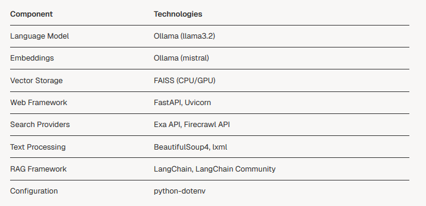

# NexusCore - MCP OLLAMA RAG AGENT - 🔍Search, 📊 Analysis and ✍️ Generate from sources

[](https://opensource.org/licenses/MIT)

Un agent conversationnel intelligent implémentant le protocole MCP (Machine Conversation Protocol) avec capacités RAG (Retrieval-Augmented Generation) utilisant Ollama comme backend LLM.


## Présentation de l'application

Cette application est un agent conversationnel intelligent qui combine plusieurs technologies avancées :

1. **Protocole MCP** : Une implémentation du standard de communication machine-to-machine pour les agents IA, permettant une intégration standardisée avec d'autres systèmes.

2. **RAG avec Ollama** : 
   - Utilisation de modèles LLM locaux via Ollama
   - Pipeline complet de traitement des documents (extraction, découpage, embedding)
   - Recherche vectorielle avec FAISS (CPU/GPU)

3. **Architecture multi-agents** :
   - Agent de recherche (combine recherche web et RAG)
   - Agent d'analyse (analyse sémantique et statistique)
   - Agent de génération (création de contenu)

4. **Fonctionnalités avancées** :
   - Logging structuré pour le débogage
   - Configuration centralisée
   - Support multi-fournisseurs de recherche (Exa, Firecrawl)
   - Gestion automatique des erreurs

L'application est particulièrement adaptée pour :
- Les assistants virtuels intelligents
- Les systèmes de recherche d'information augmentée
- Les outils d'analyse de contenu
- Les générateurs de contenu automatisés

Le système est conçu pour être extensible avec de nouveaux agents et capacités tout en maintenant une architecture propre et modulaire.

## Fonctionnalités clés

- 📚**Recherche augmentée** : Combinaison de recherche web et RAG pour des réponses précises
- 🤖 **Multi-agents** : Architecture modulaire avec agents spécialisés
- ✅**Protocole MCP** : Implémentation du standard de conversation machine-to-machine
- ✨**Intégration Ollama** : Utilisation des modèles LLM locaux via Ollama
- 📝**Traitement avancé** : Extraction, nettoyage et analyse de contenu web

## Architecture technique

```markdown
NexusCore/
│
├── app/
│   ├── agent.py                 # Main agents (research, analysis, generation)
│   ├── agent_orchestrator.py    # Agent coordination logic
│   ├── config.py                # Central configuration
│   ├── mcp_server.py            # FastAPI MCP implementation
│   ├── rag.py                   # RAG processing
│   ├── search.py                # Advanced web search
│   │
│   └── utils/
│       └── logging_service.py   # Structured logging service
│
├── pyproject.toml               # Project configuration
├── requirements.txt             # Python dependencies
└── .env.sample                  # Environment template
```

## Prérequis

- Python 3.10+
- Ollama installé localement avec au moins un modèle (ex: `llama3`)
- Clé API pour un fournisseur de recherche (Exa ou Firecrawl)


## Installation

0. Ollama
->  Installation sur votre systeme (Unix ou Windows) (https://ollama.com/)
->  Charger les modeles LLMs
```bash
# Exemple: Chargement du modele "mistral"
ollama pull mistral

# Lancement du serveur sur une session terminal indépendante.
ollama serve
```

1. Cloner le dépôt :
```bash
git clone https://github.com/votre-repo/ollama-rag-agent.git
cd ollama-rag-agent
```

2. Installer les dépendances :
->  Creer l'environnement avec uv (plus rapide et fiable)
```bash
uv venv .venv
.venv\scripts\activate # Windows
#ou 
source .venv\scripts\activate # Unix
#puis
uv pip install -r requirements.txt
```

3. Configurer l'environnement de l'application et ses paramètres :
```bash
# Éditer le fichier .env puis ajoutez vos configurations (basée sur  .env sample)
cp .env.sample .env #Unix
edit .env           #Windows

```

## Utilisation
Lancer le serveur MCP

### Lancer le serveur mcp
```bash
cd app
uv run mcp_server.py
```
Le serveur sera accessible sur http://localhost:8000 avec les endpoints suivants :

    . POST /search - Recherche augmentée
    . POST /analyze - Analyse de texte
    . POST /generate - Génération de contenu
    .  GET /health - Vérification de l'état du serveur


### Utilisation en ligne de commande:

```bash
python agent.py "Votre requête ici"
```
ou 

```bash
uv run agent.py "Votre requête ici"
```

## Configuration

Les paramètres principaux sont configurables via le fichier .env :
```bash
# Modèle Ollama
OLLAMA_MODEL=llama3.2
OLLAMA_BASE_URL=http://localhost:11434

# Paramètres RAG
RAG_CHUNK_SIZE=4096
RAG_CHUNK_OVERLAP=512

# Fournisseur de recherche
SEARCH_PROVIDER=exa  # ou firecrawl
EXA_API_KEY=votre_cle_api
```

## Licence

Ce projet est sous licence MIT - voir le fichier LICENCE.md pour plus de détails.

## Auteur

Olivier Lavaud - 2025


# Schéma MCP : Fonctionnement Central

```flowchart TB
    subgraph MCP_Core["🔷 MCP Server (FastAPI)"]
        A[Endpoint /mcp] --> B[Auth & Validation]
        B --> C[Task Decomposition]
        C --> D[Agent Selection]
        D --> E[Parallel Execution]
        E --> F[Result Aggregation]
    end

    subgraph Agents["⚙️ Agents Modules"]
        E --> G[ResearchAgent]
        E --> H[AnalysisAgent]
        E --> I[GenerationAgent]
    end

    subgraph External["🌐 Externals"]
        G --> J[(Web APIs)]
        H --> K[(Vector DB)]
        I --> L[LLM API]
    end

    F --> M[Response Formatting]
    M --> N[/Client/]
```

## Flux Critique :

    Découpage des tâches : Le MCP analyse la requête pour identifier les sous-tâches.
    *Exemple : "Recherche sur X + analyse comparative + synthèse" → 3 jobs parallèles*.

    Sélection dynamique : Utilise le config.py pour router vers les agents compétents.

    Exécution parallèle : Chaque agent travaille isolément avec son propre contexte.

    Aggrégation intelligente : Fusion des résultats partiels avec gestion des conflits.

## Séquence API Typique

```sequenceDiagram
    participant C as Client
    participant M as MCP
    participant R as ResearchAgent
    participant A as AnalysisAgent

    C ->> M: POST /mcp {query: "Comparer React et Svelte"}
    M ->> R: Task: "Recherche React"
    M ->> A: Task: "Recherche Svelte"
    R ->> M: Results (React)
    A ->> M: Results (Svelte)
    M ->> M: Cross-Analysis
    M ->> C: 200 OK {comparison: [...]}
```

# Technical Documentation
## System Purpose

MCP-RAG-Ollama serves as a versatile query answering system that combines the power of large language models with real-time information retrieval. It enables users to:

    Get answers to questions using contextual knowledge from web searches
    Implement RAG workflows with Ollama models
    Access the system via both API endpoints and command-line interface


## Architecture Overview
The system follows a layered architecture pattern, separating client interactions, server operations, core processing, and external service integrations.
<p align="center"></p>

## Core Components
The system consists of four main components that work together to provide RAG capabilities:
<p align="center">
</p>

```bash
    - MCP Server: The FastAPI server that exposes endpoints for client interactions.
    - OllamaAgent: The orchestrator that processes queries by combining web search and RAG.
    - RAG Processor: Handles document processing, embedding generation, and similarity search.
    - Web Searcher: Performs web searches and content extraction from relevant pages.
```

## Query Processing Flow
The following diagram illustrates how a user query flows through the system:

<p align="center"></p>

## Technology Stack

The MCP-RAG-Ollama system leverages multiple technologies and libraries:

<p align="center"></p>

## Deployment Architecture
The system can be deployed as follows:*

<p align="center"></p>
