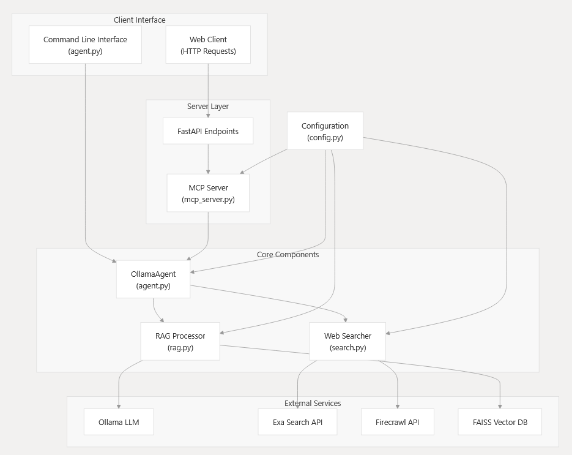
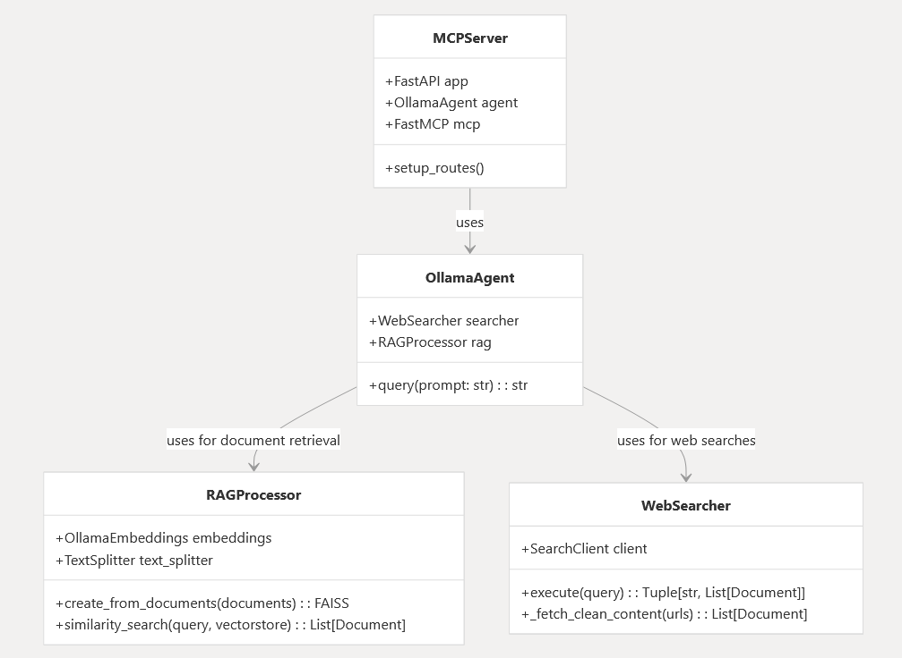
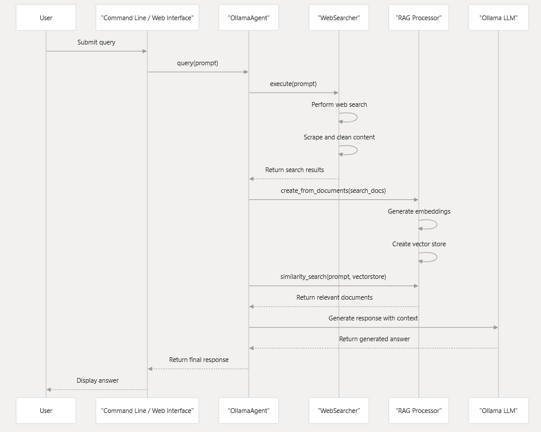
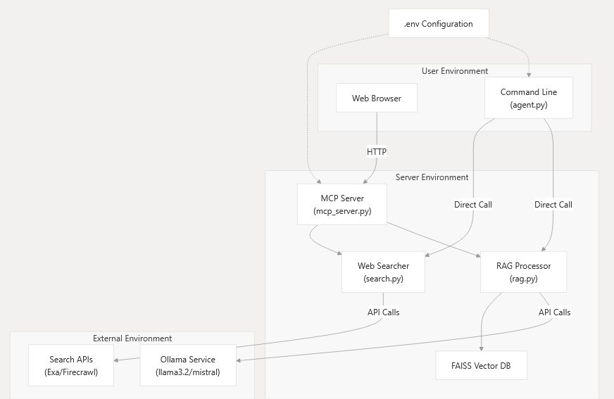

# Ollama RAG Analysis Agent

Un agent intelligent qui combine recherche web, RAG (Retrieval-Augmented Generation) et analyse LLM pour fournir des réponses enrichies avec évaluation automatique de qualité.

## Fonctionnalités clés

- 🔍 **Recherche web avancée** avec extraction des contenus pertinents
- 📚 **Intégration RAG** pour contextualiser les réponses
- 🤖 **Analyse automatique** des réponses par LLM (Ollama)
- ✅ **Évaluation de qualité** : pertinence, cohérence, biais, clarté
- ✨ **Résumé automatique** des points clés
- 📝 **Gestion transparente des sources** avec tracking complet

## Prérequis

- Python 3.9+
- Ollama installé et configuré (serveur local ou distant)
- Modèle LLM compatible (par défaut: `mistral`)

## Installation

0. Ollama
```bash
# Charger les modeles
ollama pull mistral
# Lancer le serveur
ollama serve
```

1. Cloner le dépôt :
```bash
git clone https://github.com/votre-repo/ollama-rag-agent.git
cd ollama-rag-agent
```

2. Creer l'environnement et installer les packages python 
```bash
uv venv .venv
.venv\scripts\activate # Windows
source .venv\scripts\activate # Unix

uv pip install -r requirements.txt
```

3. Lancer le serveur mcp
```bash
cd app
uv run mcp_server.py
```
##   Utiliser l'agent en CLI :

```bash
python agent.py "Votre question ici"
```
ou 

```bash
uv run agent.py "Votre question ici"
```


# Technical Documentation

## System Purpose

MCP-RAG-Ollama serves as a versatile query answering system that combines the power of large language models with real-time information retrieval. It enables users to:

    Get answers to questions using contextual knowledge from web searches
    Implement RAG workflows with Ollama models
    Access the system via both API endpoints and command-line interface


## Architecture Overview
The system follows a layered architecture pattern, separating client interactions, server operations, core processing, and external service integrations.
<p align="center"></p>

### Core Components
The system consists of four main components that work together to provide RAG capabilities:
<p align="center">
</p>

```bash
    - MCP Server: The FastAPI server that exposes endpoints for client interactions.
    - OllamaAgent: The orchestrator that processes queries by combining web search and RAG.
    - RAG Processor: Handles document processing, embedding generation, and similarity search.
    - Web Searcher: Performs web searches and content extraction from relevant pages.
```

## Query Processing Flow
The following diagram illustrates how a user query flows through the system:

<p align="center"></p>

## Technology Stack

The MCP-RAG-Ollama system leverages multiple technologies and libraries:

```bash
Component	    Technologies
Language        Model	Ollama (llama3.2)
Embeddings  	Ollama (mistral)
Vector          Storage	FAISS (CPU/GPU)
Web             Framework	FastAPI, Uvicorn
Search          Providers	Exa API, Firecrawl API
Text            Processing	BeautifulSoup4, lxml
RAG             Framework	LangChain, LangChain Community
Configuration	python-dotenv
```


# Deployment Architecture
The system can be deployed as follows:*

<p align="center"></p>

## Getting Started

To use the MCP-RAG-Ollama system, you need to:

    1. Initialize Ollama with the required models
    2. Configure your environment variables
    3. Install the Python dependencies
    4. Launch the MCP server or use the CLI agent directly

For detailed setup instructions, please refer to Installation and Set